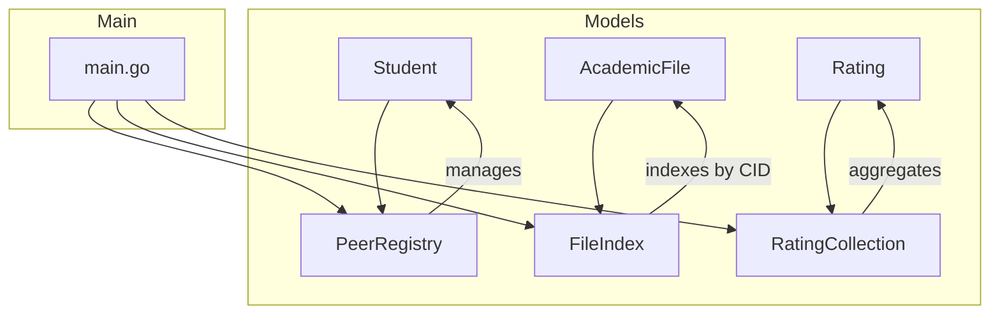

# P2P Academic Library - Code Documentation

A **Peer-to-Peer Academic Library** system written in Go, designed to demonstrate core Go programming concepts including structs, maps, slices, control flow, and concurrency primitives.

---

## 📁 Project Structure

```
project/
├── go.mod                    # Go module definition
├── cmd/
│   └── main.go               # Application entry point
└── models/
    ├── student.go            # Student/Peer data model
    ├── academicFile.go       # Academic file data model
    ├── rating.go             # Rating system data model
    └── registry.go           # Data registries (PeerRegistry, FileIndex)
```

---

## 🔧 Core Components

### 1. Student Model ([student.go](file:///f:/Golang/project/models/student.go))

Represents a peer in the P2P network.

#### Constants
| Constant | Value | Description |
|----------|-------|-------------|
| `MinReputation` | 3.0 | Minimum score to download files |
| `MaxReputation` | 5.0 | Maximum reputation score |
| `DefaultReputation` | 3.5 | Starting reputation for new students |
| `LeecherThreshold` | 2.0 | Below this = marked as leecher |

#### Struct
```go
type Student struct {
    ID              string    // Unique node identifier
    Name            string    // Display name
    Email           string    // Contact email
    ReputationScore float64   // Current reputation (0.0 - 5.0)
    IsLeecher       bool      // True if downloads > uploads
    IsOnline        bool      // Online status
    FilesShared     int       // Files shared count
    FilesDownloaded int       // Files downloaded count
    JoinedAt        time.Time // Join timestamp
    LastActive      time.Time // Last activity timestamp
}
```

#### Methods
| Method | Description |
|--------|-------------|
| `NewStudent(id, name, email)` | Creates new student with default values |
| `CanDownload()` | Checks if reputation allows downloading |
| `UpdateReputation(score)` | Updates reputation and leecher status |
| `IncrementFilesShared()` | Increments shared files counter |
| `IncrementFilesDownloaded()` | Increments download counter |
| `GetContributionRatio()` | Returns shared/downloaded ratio |
| `SetOnlineStatus(bool)` | Updates online status |
| `String()` | Formatted string representation |
| `ValidateStudent()` | Validates student data |

---

### 2. Academic File Model ([academicFile.go](file:///f:/Golang/project/models/academicFile.go))

Represents a resource shared in the P2P network.

#### Constants
| Constant | Value | Description |
|----------|-------|-------------|
| `MaxFileSize` | 100 MB | Maximum file size |
| `MinFileSize` | 1 byte | Minimum file size |
| `MaxTagsPerFile` | 10 | Maximum tags per file |
| `MaxFileNameLen` | 255 | Maximum filename length |

#### File Categories
```go
const (
    CategoryNotes      = "notes"
    CategoryTextbook   = "textbook"
    CategorySlides     = "slides"
    CategoryAssignment = "assignment"
    CategoryResearch   = "research"
    CategoryOther      = "other"
)
```

#### Struct
```go
type AcademicFile struct {
    CID           string       // Content Identifier (SHA-256 hash)
    FileName      string       // Original file name
    OwnerID       string       // Peer who shared the file
    Size          int64        // File size in bytes
    Category      FileCategory // Type of resource
    Tags          []string     // Searchable tags (max 10)
    Description   string       // Content description
    Subject       string       // Academic subject
    UploadedAt    time.Time    // Upload timestamp
    Downloads     int          // Download count
    AverageRating float64      // User rating average
    IsAvailable   bool         // Availability status
}
```

#### Methods
| Method | Description |
|--------|-------------|
| `NewAcademicFile(...)` | Creates file with generated CID |
| `IncrementDownloads()` | Increments download counter |
| `UpdateRating(total, sum)` | Updates average rating |
| `SetAvailability(bool)` | Updates availability |
| `HasTag(tag)` | Checks if file has specific tag |
| `AddTag(tag)` | Adds new tag (max 10) |
| `RemoveTag(tag)` | Removes a tag |
| `MatchesSearch(query)` | Matches against name/description/subject/tags |
| `GetFormattedSize()` | Returns human-readable size (e.g., "2.5 MB") |
| `ValidateFile()` | Validates file data |
| `GetAllCategories()` | Returns all available categories |

#### CID Generation
Uses **SHA-256** hashing combining filename, owner ID, size, and timestamp:
```go
func generateCID(fileName, ownerID string, size int64) string {
    data := fmt.Sprintf("%s:%s:%d:%d", fileName, ownerID, size, time.Now().UnixNano())
    hash := sha256.New()
    hash.Write([]byte(data))
    return hex.EncodeToString(hash.Sum(nil))
}
```

---

### 3. Rating Model ([rating.go](file:///f:/Golang/project/models/rating.go))

Represents peer-to-peer ratings in the network.

#### Constants
| Constant | Value | Description |
|----------|-------|-------------|
| `MinRatingScore` | 1.0 | Minimum rating |
| `MaxRatingScore` | 5.0 | Maximum rating |

#### Rating Struct
```go
type Rating struct {
    ID        string    // Unique rating ID
    RaterID   string    // Who gave the rating
    RateeID   string    // Who received the rating
    FileID    string    // Related file CID (optional)
    Score     float64   // Rating score (1.0 - 5.0)
    Comment   string    // Feedback comment
    CreatedAt time.Time // Timestamp
}
```

#### RatingCollection Struct
Manages a collection of ratings with aggregation methods:
```go
type RatingCollection struct {
    Ratings []Rating `json:"ratings"`
}
```

#### Methods
| Method | Description |
|--------|-------------|
| `NewRating(...)` | Creates validated rating |
| `IsPositive()` | Returns true if score >= 3.0 |
| `IsNegative()` | Returns true if score < 3.0 |
| `Add(rating)` | Adds rating to collection |
| `GetAverageScore()` | Calculates average of all ratings |
| `GetRatingsForStudent(id)` | Gets ratings received by student |
| `GetRatingsByStudent(id)` | Gets ratings given by student |
| `GetRatingsForFile(id)` | Gets ratings for specific file |
| `CountPositiveRatings()` | Counts ratings >= 3.0 |
| `CountNegativeRatings()` | Counts ratings < 3.0 |
| `GetScoreDistribution()` | Returns map of score counts (1-5) |
| `CalculateStudentReputation(id)` | Calculates avg reputation for student |
| `ValidateRating()` | Validates rating data |

---

### 4. Registry System ([registry.go](file:///f:/Golang/project/models/registry.go))

Thread-safe data registries using maps and mutex locks.

#### PeerRegistry
Manages all students/peers with **O(1) lookups**:

```go
type PeerRegistry struct {
    peers map[string]Student // Node ID → Student
    mu    sync.RWMutex       // Read/Write mutex
}
```

| Method | Description |
|--------|-------------|
| `NewPeerRegistry()` | Creates empty registry |
| `Add(student)` | Adds student (error if duplicate) |
| `Get(id)` | Retrieves student by ID |
| `Update(student)` | Updates existing student |
| `Remove(id)` | Removes student |
| `GetAll()` | Returns all students as slice |
| `GetOnlinePeers()` | Returns online students only |
| `GetLeecherPeers()` | Returns leecher students |
| `GetTopContributors(limit)` | Returns top N by reputation |
| `SearchByName(query)` | Partial name search |
| `Size()` | Returns peer count |
| `Exists(id)` | Checks if peer exists |

#### FileIndex
Manages academic files with **CID-based lookups**:

```go
type FileIndex struct {
    files map[string]AcademicFile // CID → File
    mu    sync.RWMutex
}
```

| Method | Description |
|--------|-------------|
| `NewFileIndex()` | Creates empty index |
| `Add(file)` | Adds file (error if duplicate) |
| `Get(cid)` | Retrieves file by CID |
| `Update(file)` | Updates existing file |
| `Remove(cid)` | Removes file |
| `GetAll()` | Returns all files |
| `GetByOwner(ownerID)` | Files by specific owner |
| `GetByCategory(category)` | Files by category |
| `GetAvailableFiles()` | Available files only |
| `Search(query)` | Search by name/description/subject/tags |
| `SearchByTags(tags)` | Search by tag list |
| `GetMostDownloaded(limit)` | Top N downloaded files |
| `GetTopRated(limit)` | Top N rated files |
| `GetTotalSize()` | Total size of all files |
| `GetCategoryStats()` | File count per category |

---

### 5. Main Entry Point ([main.go](file:///f:/Golang/project/cmd/main.go))

Initializes the application and demonstrates all Phase 1 concepts.

#### Global Registries
```go
var (
    peerRegistry     *models.PeerRegistry
    fileIndex        *models.FileIndex
    ratingCollection *models.RatingCollection
)
```

#### Sample Data
Creates 5 sample students with varying reputations and 5 academic files across different categories to demonstrate:
- **Variables & Types**: Type inference with `:=`
- **Struct Creation**: Using factory functions
- **Maps**: PeerRegistry and FileIndex operations
- **Slices**: Tag management, filtering results
- **Control Flow**: If/else, for loops, range iterations
- **Leecher Detection**: Students with low reputation flagged

---

## 🎯 Key Go Concepts Demonstrated

### 1. Structs & Methods
```go
// Value receiver (read-only)
func (s Student) String() string { ... }

// Pointer receiver (modifies struct)
func (s *Student) UpdateReputation(score float64) { ... }
```

### 2. Maps for O(1) Lookups
```go
peers := make(map[string]Student)
student, exists := peers["node_001"] // ok pattern
```

### 3. Slices for Dynamic Collections
```go
tags := []string{"algorithms", "data-structures"}
tags = append(tags, "new-tag")
```

### 4. Control Flow
```go
if score >= MinReputation {
    return true
} else if score < LeecherThreshold {
    s.IsLeecher = true
}

for i, peer := range allPeers { ... }
```

### 5. Concurrency (sync.RWMutex)
```go
pr.mu.Lock()          // Exclusive lock for writes
defer pr.mu.Unlock()

pr.mu.RLock()         // Shared lock for reads
defer pr.mu.RUnlock()
```

### 6. Multiple Return Values
```go
func ValidateStudent(s Student) (bool, string) {
    if s.ID == "" {
        return false, "Student ID cannot be empty"
    }
    return true, ""
}
```

### 7. Custom Types
```go
type FileCategory string

const CategoryNotes FileCategory = "notes"
```

---

## ▶️ Running the Application

```bash
cd f:\Golang\project
go run ./cmd/main.go
```

### Expected Output
```
╔════════════════════════════════════════════════════╗
║     The Knowledge Exchange - P2P Academic Library  ║
║                   Phase 1: Core Logic              ║
╚════════════════════════════════════════════════════╝

=== Peer Registry Initialized ===
Total Peers: 5

=== File Index Initialized ===
Total Files: 5

=== Demonstrating Control Flow ===
1. Student{ID: 001, Name: Alice Johnson, Reputation: 4.50, Status: Online}
   ✓ Can download files
...

=== Leecher Detection ===
Found 1 leecher(s):
  - David Brown (Reputation: 1.50)

=== Search Demo ===
Search for 'algorithms' returned 1 result(s):
  - File{CID: abc123..., Name: Algorithms_Notes.pdf, Size: 2.00 MB, ...}

=== Category Statistics ===
  notes: 1 file(s)
  textbook: 1 file(s)
  slides: 1 file(s)
  ...

=== Rating Statistics ===
Total Ratings: 5
Average Score: 4.66
Positive Ratings: 5
```

---

## 📊 Data Flow Diagram



---

## 🔐 Validation Rules

### Student Validation
- ID cannot be empty
- Name cannot be empty
- Reputation must be 0.0 - 5.0

### File Validation
- CID cannot be empty
- Filename cannot be empty or exceed 255 chars
- Size must be 1 byte - 100 MB
- Owner ID cannot be empty

### Rating Validation
- Rating ID, Rater ID, Ratee ID cannot be empty
- Cannot rate yourself (rater ≠ ratee)
- Score must be 1.0 - 5.0

---

## 📝 Summary

This project implements a **P2P Academic Library** system showcasing:

| Feature | Implementation |
|---------|----------------|
| **Data Models** | Student, AcademicFile, Rating structs |
| **Storage** | Map-based registries with O(1) lookups |
| **Thread Safety** | sync.RWMutex for concurrent access |
| **Search** | Multi-field search with tag support |
| **Reputation** | Scoring system with leecher detection |
| **File Hashing** | SHA-256 based CID generation |
| **Validation** | Comprehensive data validation functions |
